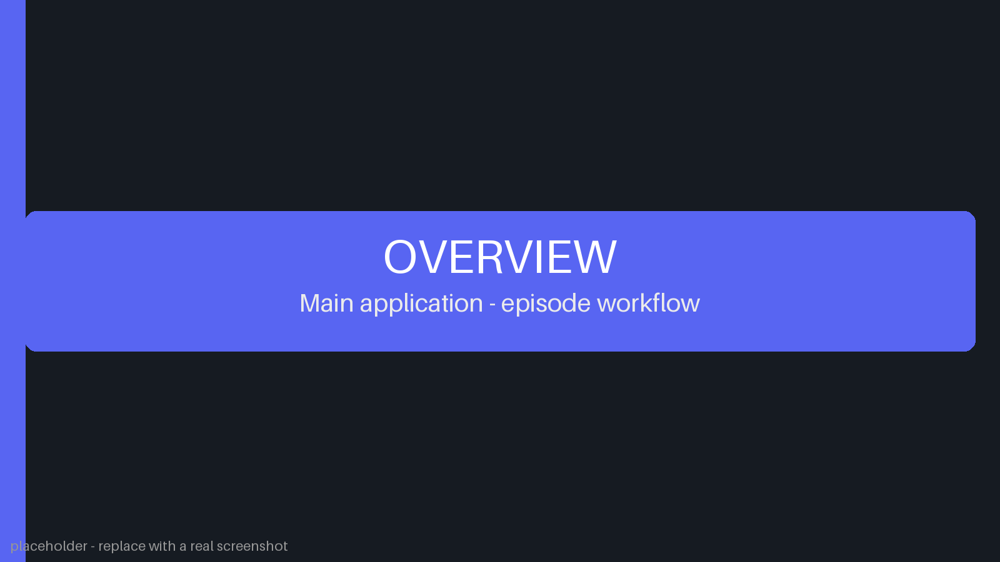

# 🤔 Curious About Things

Curious About Things is a one-click production pipeline for curiosity-driven
YouTube Shorts and Instagram Reels. The AI is free to choose any genuinely
fascinating topic — science, history, animals, geography, technology,
psychology, space, mysteries, unusual events, human behavior, or anything
else — and the application turns it into a finished vertical Short:

```text
Prompt (optional topic instruction)
  ↓
AI generates title + summary + narration + visual search queries
  ↓
Generate Video (one click)
  ├─ narration audio with word-level timings
  ├─ stock footage per visual search query
  ├─ royalty-free background music
  ├─ synchronized captions
  └─ compose & render 1080×1920 @ 30 fps Short
  ↓
Preview
  ↓
Upload to YouTube / Instagram
```

---

## Screenshots



The Web UI drives the whole pipeline: create an episode, run the video
job, preview the rendered Short in the episode grid, and publish it.

|                        |                          |
| ---------------------- | ------------------------ |
|  |  |

The images above are placeholders. Capture fresh screenshots of the app
and drop them into `web/screenshots/` — `overview.png`, `instagram.png`,
and `youtube.png` — and the README picks them up automatically.

---

## Requirements

* Python 3.12
* Chrome (for the Selenium-based stock footage provider)
* A local [Ollama](https://ollama.com) instance for content generation
* FFmpeg (bundled automatically via `imageio-ffmpeg`)

## Install

### Windows

```bat
install_windows.bat
```

### Linux / macOS

```bash
./install_linux.sh
```

## Run

### Windows

```bat
run_windows.bat
```

### Linux / macOS

```bash
./run_linux.sh
```

Then open **http://localhost:8000**.

There is also a CLI entry point (`python main.py`) that creates one episode
end-to-end without the web UI.

---

## Using the Web UI

1. **Create Episode** — optionally type a topic or instruction for the AI.
   With *Prompt Only* checked, only the AI content stage runs.
2. **Generate Video** — runs the full production pipeline.
3. **Preview** — watch the rendered episode right in the episode grid.
4. **Upload** — YouTube and Instagram upload forms are prefilled from the
   episode title and summary.

The **Videos** tab is a placeholder for future long-form support.

---

## Episode Workspace

Each episode lives in its own numbered directory under `media/output/shorts/`:

```text
media/output/shorts/<episode>/
├── content.json         # Structured AI content (title, summary, narration, mood, visuals)
├── prompt.txt           # Human-readable TITLE/PROMPT/SUMMARY (upload metadata)
├── audio/
│   ├── narration.mp3    # Generated narration audio
│   └── words.json       # Word-level timings from the TTS stream
├── footage/
│   └── <query>/         # Downloaded stock footage per visual search query
│       └── clip_NNN.mp4
├── music/               # Downloaded royalty-free background track + license metadata
├── captions/
│   └── captions.srt     # Captions synchronized with the narration
├── sfx/                 # Optional: sound effects mixed into the video
├── episode.mp4          # Final rendered Short
└── upload.txt           # Per-platform upload flags (created on first upload)
```

Optional SFX: any audio file in the episode's `sfx/` folder is mixed into
the video. A numeric filename prefix sets the offset —
`sfx/1.5__whoosh.mp3` plays 1.5 seconds into the video.

---

## Configuration

All configuration lives in `config/`:

| File             | Purpose                                                             |
| ---------------- | ------------------------------------------------------------------- |
| `app.json`       | `video_provider` / `music_provider` selection, Shorts specs (duration, 1080×1920, 30 fps), audio, captions |
| `pexels.json`    | All Pexels-specific settings (headless, timeouts, candidates, profile) |
| `freesafemusic.json` | FreeSafeMusic search/download settings for background music      |
| `content.json`   | Channel identity and AI content-generation guidance                 |
| `ai_models.json` | Language model settings (Ollama)                                    |
| `youtube.json`   | YouTube API settings and metadata defaults                          |
| `instagram.json` | Instagram API settings and caption defaults                         |

### Stock footage providers

The video-generation pipeline works with a generic provider interface:

```text
search(query)   → candidate videos
download(...)   → local footage
```

The active provider is selected with a single generic value:

```json
{ "video_provider": "pexels" }
```

All provider-specific settings are isolated in a dedicated section
(`config/pexels.json`), so adding another provider later (e.g. Pixabay)
means adding one module under `production/footage/` and one config file — the
rest of the pipeline stays unchanged.

Pexels sits behind Cloudflare, which occasionally answers a page load with
its "Just a moment..." bot check instead of the search results. That page
has no video grid at all, so it is detected explicitly and waited out for
up to `challenge_timeout_seconds` (`config/pexels.json`) while the run
keeps reporting progress — it usually clears on its own, and with
`headless: false` it can also be cleared with a click in the browser
window while the run is waiting. If the check is still up when the wait
ends, the run fails with a message naming the bot check (instead of the
misleading "Search results page did not load") so it is clear that the
check, not the search, needs attention.

Selected clips are fetched straight from Pexels' download URL with
`requests` (`direct_download: true` in `config/pexels.json`) instead of
being streamed by the browser: the browser reached only ~0.2 MB/s and
occasionally stalled mid-file on 4K clips, while the same file arrives at
30+ MB/s directly. Because nothing is downloaded through the browser, the
results page is no longer reloaded after every clip either, which removes
the main trigger of the bot check above. The hover/click download remains
as an automatic fallback (set `direct_download: false` to always use it).

### Shorts requirements

Configured in `app.json` under `shorts`:

* 9:16, 1080 × 1920, 30 FPS
* Target ≈ 50 seconds of narration

The **narration is the primary timeline**. The episode is synthesized at
its natural speaking pace and is never trimmed to fit a time window — the
video always matches the narration (plus a short tail), so nothing is
ever cut off. Resolution and frame rate are fixed by the `shorts`
settings when the video is rendered.

### AI content structure

The Prompt stage returns structured data the pipeline depends on:

```json
{
  "title": "...",
  "summary": "...",
  "mood": "...",
  "narration_sentences": ["... x14 ..."],
  "narration": "...",
  "visuals": [
    { "context": "...", "search_query": "..." }
  ]
}
```

The narration follows a flexible storytelling arc — hook, setup,
escalation, surprising reveal, connection, twist, closing thought — and
is generated as exactly 14 sentences targeting roughly 50 seconds when
spoken. Each sentence maps 1:1 to a visual search query, so the footage
changes in sync with what is being said. Visual search queries describe
what should appear in the footage; the application handles finding and
downloading it.

### Background music and SFX

The Generate Video stage downloads a royalty-free background track from
FreeSafeMusic through the configured `music_provider`; the file is stored
in the episode's `music/` directory for the render and its license
metadata is kept afterwards. The composer loops the track under the
narration at a low volume, and any optional SFX placed in the episode's
`sfx/` folder is mixed in as well. Narration is always clearly audible;
music and SFX support it without overpowering it.

---

## Project Layout

```text
ai/           AI content generation (Prompt stage, Ollama provider)
core/         Config loading and the top-level pipeline
production/   Video production: narration, footage & music providers, captions, composer, render
web/          HTTP server, job worker, and the single-page UI
youtube/      YouTube authentication and upload
instagram/    Instagram authentication and publishing
config/       Configuration files
media/        Generated episodes (output/shorts/) and provider browser profile
```

---

# 📺 YouTube Uploads

Completed episodes can be uploaded directly from the web UI. Each episode card with a finished `episode.mp4` includes an **Upload to YouTube** button that opens a metadata and authentication modal.


### Upload metadata

The modal allows the following video fields to be reviewed and changed before upload:

* **Channel Name** — human-readable channel name. The server resolves this through the authenticated Google account using `channels.list(mine=true)` and refuses missing, unmatched, or ambiguous names.

* **Title** — prefilled from the `TITLE:` value in the episode's `prompt.txt`.

* **Description** — prefilled from the episode `TITLE:` and short `SUMMARY:` (not the long generation prompt), followed by default hashtags from `config/youtube.json`.

* **Tags** — comma-separated YouTube tags.

* **Category ID** — YouTube's numeric category identifier. The default is `24` (Entertainment).

* **Privacy Status** — `private`, `unlisted`, or `public`.

* **Made for Kids** — controls the corresponding YouTube audience declaration.

### OAuth credentials

The account section contains only the values needed for OAuth authentication:

* OAuth Client ID
* OAuth Client Secret
* Refresh Token

Credentials are loaded from `.env` using these keys:

```env
youtube_client_id=YOUR_CLIENT_ID
youtube_client_secret=YOUR_CLIENT_SECRET
youtube_refresh_token=YOUR_REFRESH_TOKEN
```

Uppercase variants (`YOUTUBE_CLIENT_ID`, `YOUTUBE_CLIENT_SECRET`, and `YOUTUBE_REFRESH_TOKEN`) are also supported. Environment values override the corresponding values in `config/youtube.json`, allowing that JSON file to contain only non-secret defaults such as `channel_name`.

The token helper reads the client ID and client secret from `config/youtube.json` (or `.env`) automatically, opens Google's consent screen, and writes the resulting refresh token back to `.env`:

```powershell
python -m youtube.refresh_token
```

The OAuth flow requires both `youtube.upload` and `youtube.readonly` scopes. The readonly scope is used to resolve and verify the human-readable Channel Name before uploading. If an existing refresh token was created without that scope, run the helper again and approve the additional permission.

### Upload process

The backend exchanges the refresh token for a temporary access token, verifies the requested channel, and uploads the MP4 through the YouTube Data API v3 resumable upload protocol. Access tokens expire after approximately one hour; they are regenerated automatically and do not need to be stored manually.

For Google accounts managing multiple Brand channels, authorize the intended channel/account context and test the first upload with `private` visibility. YouTube's standard `videos.insert` endpoint does not provide a normal target-channel parameter, so the application rejects channel-name mismatches instead of guessing.

# 📸 Instagram Uploads

Completed episodes can also be published as Instagram **Reels** directly from the web UI. Each episode card with a finished `episode.mp4` includes an **Upload to Instagram** button next to the YouTube button.


## Modal fields

The form keeps only what is required:

**Account** (prefilled from `.env`, editable per publish):

* **Access Token** — long-lived Instagram API token (~60 days)
* **Instagram User ID** — numeric ID of the Instagram professional account

**Post:**

* **Caption** — prefilled as `TITLE` + `SUMMARY` + default hashtags from `config/instagram.json`, fully editable

## Public URL requirement

Instagram's servers fetch the video themselves, so publishing requires a **publicly reachable HTTPS URL** for the episode MP4. The application derives it automatically from however you are browsing the UI:

* Locally: run `run_windows.bat` with cloudflared installed — the script auto-starts a quick tunnel and prints the public URL. Browse the app through that URL.
* On RunPod: expose port 8000 as an HTTP port and browse through the provided `https://<pod-id>-8000.proxy.runpod.net` URL.

If the derived host is `localhost`, the server logs a warning and publish failures include the exact unreachable URL for diagnosis.

## Credentials and token refresh

Credentials live only in `.env` (never in JSON config):

```env
instagram_access_token=...
instagram_user_id=...
```

Optional, only needed when `config/instagram.json` points at `graph.facebook.com` instead of the default `graph.instagram.com`:

```env
instagram_app_id=...
instagram_app_secret=...
```

Refresh the ~60-day token before it expires — no arguments needed:

```powershell
python -m instagram.refresh_token
```

The helper exchanges the current still-valid token via the appropriate grant (`ig_refresh_token` on `graph.instagram.com`, `fb_exchange_token` on `graph.facebook.com`) and writes the new token back to `.env` automatically.

## Publish process

The backend validates the account, builds the public video URL, then follows Instagram's container flow: create a media container pointing at the video URL → poll until Meta finishes processing → publish the container → resolve the post permalink. Processing can take a few minutes; keep both the server and tunnel/proxy alive until it completes.

## Upload tracking

Every episode folder can contain an `upload.txt` file recording which
platforms the episode has been published to:

```text
youtube=true
instagram=false
```

The web UI keeps this file in sync automatically:

* A successful YouTube or Instagram upload marks that platform as done.
* Each upload modal includes a **"Mark as Done"** toggle for manually
  marking (or unmarking) a platform.
* Uploaded platforms show a green checkmark on the episode card buttons.

---

## 📜 License

Copyright © 2026 Aden Tran. All rights reserved.

This repository is publicly available for viewing and reference purposes only. No permission is granted to use, copy, modify, distribute, sublicense, or commercially exploit this code without explicit written permission from the copyright holder.
